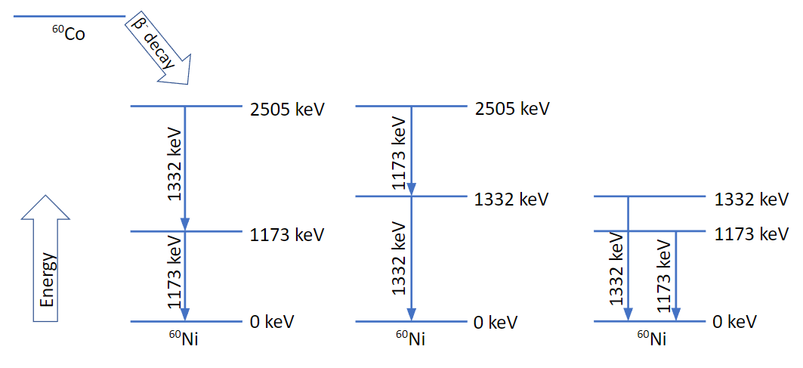

**Jump to:**

- [Equipment](https://github.com/UWCNuclear/GammaCoincidence#equipment)
- [Introduction](https://github.com/UWCNuclear/GammaCoincidence#introduction)
- [Questions](https://github.com/UWCNuclear/GammaCoincidence#questions)
- [Activity 1: Coincidences with an Analog Experimental Setup](https://github.com/UWCNuclear/GammaCoincidence#activity-1-coincidences-with-an-analog-experimental-setup)
- [Questions (continued)](https://github.com/UWCNuclear/GammaCoincidence#questions-continued)
- [Activity 2: Coincidences with a Digital Experimental Setup](https://github.com/UWCNuclear/GammaCoincidence#activity-2-coincidences-with-a-digital-experimental-setup)
- [Activity 3: Sorting Data Files from a Digital Experimental Setup](https://github.com/UWCNuclear/GammaCoincidence#activity-3-sorting-data-files-from-a-digital-experimental-setup)
- [Questions (continued 2)](https://github.com/UWCNuclear/GammaCoincidence#questions-continued-2)
- [Reporting](https://github.com/UWCNuclear/GammaCoincidence#reporting)
- [References](https://github.com/UWCNuclear/GammaCoincidence#references)

## Equipment
- Radioactive sources: 22Na (511 & 1274 keV), 137Cs (662 keV), and 60Co (1173 & 1333 keV)
- Two NaI(Tl) scintillators, two photomultiplier tubes assembly, and two detector stands
- Analogue setup: NIM crate, HV power supply with 2 outputs, 1 Dual Spec Amplifier, 2 CFD or SCA, 1 Universal Coincidence Module, Data acquisition laptop with Palmtop MCA
- Digital setup: XIA crate, Pixie-16 module, Data acquisition desktop with Poll2 software
- Oscilloscope
- BNC and SHV cables

## Introduction

In this experiment, we will be measuring gamma rays – these are the rays coming from the nucleus. Gamma rays are the highest energy electromagnetic radiation we know, even higher than X-rays, and they easily travel through matter [Krane].

The typical analogue signal processing and acquisition chain includes these steps: 
Series of modules with a single task → MCA → Histogram [Leo, Knoll] 

The typical digital signal processing and acquisition chain includes these steps: 
Digitizer → Code → List mode → Sorting code → Histogram code → Any histograms and matrices [CAEN, XIA, Kapoor]

## Questions
1. What is gamma-ray emission?
2. How do gamma rays interact with matter?
3. Which type of detector is a NaI(Tl) crystal? How do they work?
4. How do photo-multiplier tubes work? Which types of interactions are involved?
5. What is the rest mass energy of an electron in MeV? (Mass is 9 x 10-31 kg)

# Activity 1: Coincidences with an Analog Experimental Setup
- Make sure the high voltage cable is correctly connected (HV point on the detector to the POS HIGH VOLTAGE of the HV power supply module) as well as the coaxial cable that connects the anode on the detectors to the INPUTS of the preamp module.
- Switch on the NIM crate, the Data Acquisition laptop, and the Palmtop MCA. Start the MCA software on the PC.
- On the HV module, set the voltage to 0 V and switch on the module.
- Place the 22Na source in the source holder between the detectors. This source gives off gamma rays with energies of 511 keV and 1274 keV. Make sure that the other sources are on the other side of the room to not cause background radiation in the spectrum!
- Connect the pre-amp of one detector to channel 1 of the oscilloscope and look at the output (There should be nothing!). (The signal from the detector is first fed into a pre-amplifier.) Repeat by connecting the second detector in channel 2 of the oscilloscope.
- Slowly increase the voltage to 1250 V. Make sure this is correctly done else you will see nothing!
- Make a rough sketch of the oscilloscope figure in your report. Indicate the time and voltage scale used.
- With extra BNC cables, connect the pre-amp output to the Dual Spec Amplifier input. Look at the Dual Spec Amplifier output on the oscilloscope and make a sketch. Repeat for the second detector and the second Dual Spec Amplifier module.
- If the above is working correctly, you can start to look at the spectrum on the MCA software by connecting the Dual Spec Amplifier output to the MCA input. Learn to use the icons – green arrow to start, read square to stop the counting, and yellow square to delete the spectrum. Repeat for the second detector and the second Dual Spec Amplifier module.

The setup uses a Palmtop Multi-channel analyser (MCA) to digitise the signals. This is what computer people call an ADC – an **analogue-to-digital converter**. It turns the amplitude of the signal into a channel number. We have up to 8192 so-called “channels” that store the number of counts in a specific energy gap. A high amplitude signal goes into a high channel and a low energy signal into a low channel, in a proportional way. These channels are now displayed from left to right on the display. So, high energy is to the right and low energy to the left.

As you saw from the oscilloscope, the pre-amplifier gives output pulses that are a few volts high. The heights of these pulses are proportional to the ENERGY of the incoming gamma ray. You can check this by looking at the signal of the 22Na source and comparing it to the 60Co source that gives off higher energy gamma rays. 

- Connect the Dual Spec Amplifier output to the CFD/SCA input. Look at the CFD/SCA output on the oscilloscope and make a sketch. (Note that this signal is VERY different from the pre-amplifier output.) Repeat for the second detector and the second CFD/SCA module.
- Connect the two CFD/SCA outputs to the universal coincidence module inputs.
- Connect the universal coincidence module output to the MCA input and acquire a spectrum on the MCA for a few minutes.

## Questions (continued)
6. What do the acronyms HV, NIM, CFD and SCA mean?
7. What does the MCA spectrum look like for the CFD/SCA output? Save figures.
8. Are the coincidence module output signals different? Why or why not?
9. What conditions need to be met for the coincidence module to emit a pulse?

- On the HV module, slowly decrease the voltage to 0 V and switch off the module and the NIM crate.
- Gently disconnect the signal coaxial cables from the two detectors.

# Activity 2: Coincidences with a Digital Experimental Setup
- Switch on the XIA crate and reboot the Data Acquisition desktop.
- Using a terminal, start the Poll2 software on the PC by navigating to ~/paass-lc/acq and typing “poll2”:

      cd ~/paass-lc/acq
      poll2
- Make sure the high voltage cable is correctly connected (HV point on the detector to the POS HIGH VOLTAGE of the HV power supply module) as well as the coaxial cable that connects the anode on the detector to the channels 0 and 1 of the Pixie-16 module.
- Place the 22Na source in the source holder between the detectors. Make sure that the other sources are on the other side of the room to not cause background radiation in the spectrum!
- Switch on the NIM crate.
- On the HV module, set the voltage to 0 V and switch on the module.
- Slowly increase the voltage to 1250 V. Make sure this is correctly done else you will see nothing!
- Type “run” to start the acquisition. After a few minutes (5 minutes for 22Na and 137Cs, 10 minutes for 60Co), type “stop” to stop the acquisition.

      run
      stop
- Replace the 22Na source by a 60Co source and acquire data (run, stop) for a few minutes. 
- Repeat with a 137Cs source.
- Type “exit” to exit poll2.
- Once you have acquired data with the 3 sources, copy the 3 .ldf files to a USB key.
- On the HV module, slowly decrease the voltage to 0 V and switch off the module and the NIM crate.
- Return the sources to the storage room.

# Activity 3: Sorting Data Files from a Digital Experimental Setup
Like for the analogue system, the heights of the pulses are proportional to the ENERGY of the incoming gamma ray. The positioning of a certain energy signal on the spectrum depends on the amplification and the calibration parameters. Therefore, a linear relationship can be found between the energy and the channel number: Energy = ***a****Channel + ***b***, where the slope ***a*** is the gain and the intercept ***b*** is the offset.

Remember the procedure that was done with the analogue set-up in the previous practicals:
- With a 137Cs source, acquire a spectrum for a few minutes and identify the 662-keV photopeak (full-energy peak). When the acquisition is off, choose a Region of Interest (ROI) around the peak to get the CENTROID value, which is the channel number where the peak is located.
- Repeat with sources of  22Na (2 peaks) and 60Co (2 peaks), for a total of 5 peaks. While doing this, *make sure that you do not change the voltage or the amplification*, because this will change the energy vs. channel number relationship. 
- With these energies and channels, we can now get the channel number and energy relationship. Use Excel to find the relationship so that you get an energy scale at the bottom instead of a channel scale.

For the digital system, the gain and offset are applied when sorting the data acquired using the sorting code ***xia4ids***.

- In the computer lab, using the Ubuntu terminal, follow the instructions (4 steps) to install the sorting codes xia4ids (https://github.com/UWCNuclear/xia4mandela):

**Step 1.**	To download xia4ids, paste the following line in your terminal:

    git clone https://github.com/rlica/xia4ids
    
**Step 2.**	Open your .bashrc file (gedit ~/.bashrc) and add the following line before saving and closing the file:

    PATH=$PATH:~/xia4ids/bin/

**Step 3.**	Paste the following command in the terminal:

    source ~/.bashrc

**Step 4.**	To compile, go to ~/xia4ids/ and type:

    make
    
- Follow the instructions below to copy the required calibration and configuration files for xia4ids:

      git clone https://github.com/UWCNuclear/xia4mandela
      cd xia4mandela
      mkdir raw
To create a ROOT tree (Run###.root) and a matrix file (histo_###.root) from your .ldf files, follow the following instructions.
- Copy your 3 .ldf files from your USB key to your Desktop in Windows.
- Then, from the Ubuntu terminal, go to the raw directory and type:

      mv /mnt/c/Users/user/Desktop/run_0* .
- From the xia4mandela directory, compile the Run_ldf.sh script with the command:

      g++ histo_ldf.cxx `root-config --cflags --libs` -O3 -o histo_ldf
- Use the following command to run the script to automatically sort your data and create the files:

      chmod +x *
      ./Run_ldf.sh

Now, you can look at your gamma-ray data using ***GRSISort***!

***If you run into any sorting issues, there are sorted ROOT files attached to this repository so you finish this prac.***

If you want to install GRSISort on your own computer, follow the instructions for **Ubuntu, ROOT and GRSISort** from the GitHub: https://github.com/UWCNuclear/UbuntuSetUp

Remember that **Xming** has to be on to open any graphical window :-)

To look at 1D histograms for channels 0 and 1 and save screenshots of the histograms:

- Open the histogram files with: grsisort -l histo_###.root

- From the GRSISort terminal, look at the list of what is inside a ROOT file: .ls

- Plot the histograms with: Chan00_Singles->Draw()

- To get rough energy labels, put your cursor on the histogram and press: s

- To zoom in, click on the histogram on the left and right limits of the range you want to zoom, and  press: e

- To zoom out, press: o

- Save screenshots of the histograms  :-)

- Repeat with the histogram of the second detector: Chan01_Singles

To look at the 2D coincidence matrix and save screenshots of the histograms:

- Plot the 2D matrix with: Matrix_All->Draw(“colz”) and press l (like log) to display the z-axis on log scale.

- To see the matrix projection and gate on a peak, type: new TBGSubtraction(Matrix_All)

- On the left histogram, move the green lines to frame a peak of interest. Make sure that the blue lines for the background window are away from any peaks. On the right histogram, note the energy of peaks that are observed in coincidence with the peak in the green window, if any.

- Repeat for each peak on interest (511 and 1274 keV in 22Na, 1173 and 1332 keV in 60Co, and 662 keV in 137Cs)

- Save screenshots of the gated histograms  :-)

## Questions (continued 2)
10. The 1173-keV gamma ray in 60Co is in coincidence with which gamma ray?

The 1332-keV gamma ray in 60Co is in coincidence with which gamma ray?

Which one(s) of the following decay schemes might correspond to 60Co? Why and why not?

11. The 511-keV gamma ray in 22Na is in coincidence with which gamma ray?

The 1274-keV gamma ray in 22Na is in coincidence with which gamma ray?

What might the decay scheme for 22Na look like? Why?

What if the 511-keV gamma rays come from e-/e+ pair production rather than from the decay?

12. The 662-keV gamma ray in 137Cs is in coincidence with which gamma ray?

What might the decay scheme for 137Cs look like? Why?

13. Does the National Nuclear Data Center [NNDC] agree with your findings?

## Reporting

Record all your results, figures, settings, and reasoning for all the activities of this practical in your report.

Make sure you answer all the questions.

You can find the [marking rubric here](https://docs.google.com/document/d/17nqnS2tgA3YvmCIROZFLO4soWhkX_9ISiXuKfEww6I4/edit?usp=sharing).

## References

[Krane] K.S. Krane, Introductory Nuclear Physics (1988).

[Leo] W.R. Leo, Techniques for Nuclear and Particle Physics Experiments (1994).

[Knoll] G.F. Knoll, Radiation Detection and Measurement (1989).

[CAEN] WP2081 Digital Pulse Processing in Nuclear Physics, https://www.caen.it/?downloadfile=4247

[XIA] User's Manual Digital Gamma Finder (DGF), https://xia.com/wp-content/uploads/2018/04/DGF4C_UserManual_308.pdf

[Kapoor] K. Kapoor et al., Modern African nuclear detector laboratory, Hyperfine Interact (2019) 240:64

[NNDC] National Nuclear Data Center, https://www.nndc.bnl.gov/ensdf/
